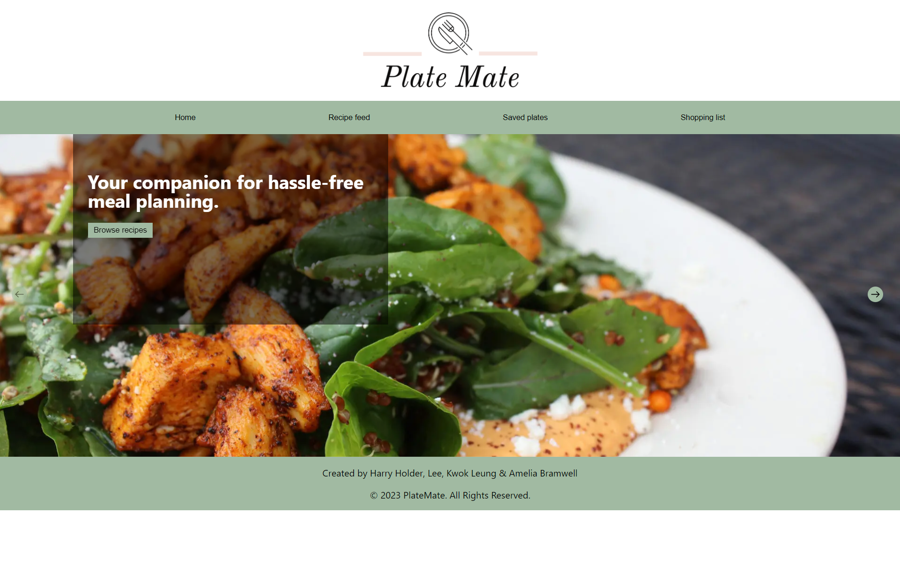

# Plate Mate

## Description

This is the final project for the edX Skills Boot Camp in Front-End Web Development to build a client-side application by a group of members.

Many individuals and families face uncertainty about deciding what to cook and eat for a meal. The application aims to help people get ideas and plan meals without stress and hassle.

---

 ## Table of Contents
  * [Description](#description)
  * [User Story](#user-story)
  * [Usage](#usage)
  * [Technical Acceptance Criteria](#acceptance-criteria)
  * [Mock-Up](#mock-up)
  * [Technologies](#new-technologies)
  * [Review](#review)
  * [Credits](#credits)
  * [Helpful Resources](#helpful-resources)

---

## User Story

AS A homemaker, I WANT to get ideas and plan the meals for my family SO THAT I can create a shopping list to plan meals quickly and easily.      

---

## Usage

After download, the application can be installed and invoked by using the following commands at the terminal:

```bash
npm install
```

```bash
npm start
```

---

## Acceptance Criteria

# Technical (0/20)

* Application uses React (0/5)

* Application uses Node (0/5)

* Application uses at least two libraries, packages, or new technologies (0/5)

* Application has both GET and POST routes for retrieving and adding new data (0/5)

# Concept (0/10)

* Group presented unique and novel project idea (0/5)

* Group clearly and concisely articulated project idea (0/5)

# Deployment (0/20)

* Group demoed application using deployed live application URL at Netlify (0/10)

* Every group member submitted application GitHub URL (0/10)

# Repository Quality (0/10)

* Repository has a unique name (0/2)

* Repository follows best practices for file structure and naming conventions (0/2)

* Repository follows best practices for variable and function naming conventions, indentation, quality comment (0/2)

* Repository contains multiple descriptive commit messages (0/2)

* Repository contains quality README with description, screenshot, link to deployed application (0/2)

# Application Quality (0/15)

* Application user experience is intuitive and easy to navigate (0/5)

* Application user interface style is clean and polished (0/5)

* Application is responsive (0/5)

# Presentation (0/10)

* Group presented using Powerpoint or similar presentation software (0/3)

* Every group member spoke during presentation (0/4)

* Presentation followed Project Presentation Template (0/3)

# Collaboration (0/15)

* GitHub contributions (0/15)

---

## Mock-Up

The following images shows a mock-up of the generated HTML file’s appearance and functionalities:

On the home page, you can see a styled and clean design of the theme with a clear message to guide users for meal planning.



On the Recipe feed page you can see a collection of recipe and meal ideas with a filter for options.


On the Saved plates page you will see the screen after you searched for a country.


On the Shopping list page you will see the screen after you searched for a country.


---

## New Technologies

TheMealDB, Material UI

---

## Review

---

The Plate Mate group members review each other's code, providing feedback on errors and making sure that all of the acceptance criteria have been met.

* [The URL of the deployed application](https://plate-mate.netlify.app/)

* [The URL of the GitHub repository.](https://github.com/Zwirled/plate-mate.git)

---

## Credits

Harry Holder, Lee, Kwok Leung & Amelia Bramwell

---

## Helpful Resources

- [Create React App documentation](https://facebook.github.io/create-react-app/docs/getting-started)

- [React documentation](https://reactjs.org/)

- [Making a Progressive Web App](https://facebook.github.io/create-react-app/docs/making-a-progressive-web-app)

- [Advanced Configuration](https://facebook.github.io/create-react-app/docs/advanced-configuration)

- [Deployment](https://facebook.github.io/create-react-app/docs/deployment)

- [MDN Javascript Documentation](https://developer.mozilla.org/en-US/docs/Web/JavaScript/)

- [Github Pages Guide](https://pages.github.com/)